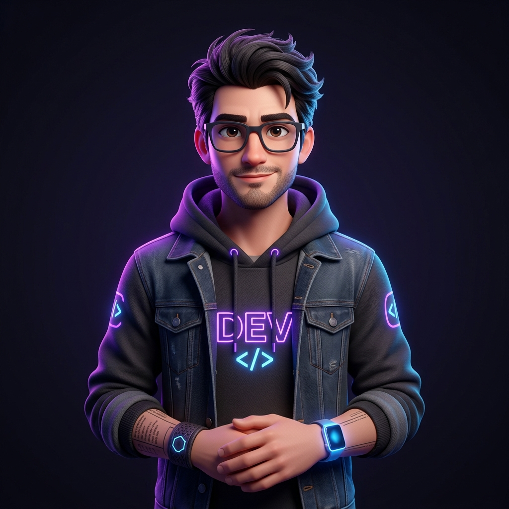

# Zney - 3D Creator Portfolio

A modern, highly interactive, and visually striking personal portfolio website for **Zney**, a talented 3D creator and developer. Built with performance and aesthetics in mind, this project showcases a dark-themed UI, smooth scroll animations, and dynamic content integration.



## ✨ Key Features

- **Immersive Hero Section:** Large typography with a magnetic, interactive 3D portrait at the center.
- **Dynamic Scroll Animations:** Utilizing Framer Motion for beautiful text reveals, fade-ins, and scroll-linked transformations.
- **Marquee Showcase:** A continuous scrolling marquee to display visual assets and dynamic GIFs.
- **Sticky Stacking Cards:** An engaging projects section where cards seamlessly stack on top of each other as the user scrolls.
- **Interactive Dropdown Menus:** Modern UI interactions like the glowing "Contact Me" dropdown to easily access social links.
- **Automated Deployments:** Fully configured with GitHub Actions to automatically build and deploy to GitHub Pages on every push.

## 🛠️ Tech Stack

- **Framework:** React 18
- **Build Tool:** Vite
- **Language:** TypeScript
- **Styling:** Tailwind CSS
- **Animations:** Framer Motion
- **Icons:** Lucide React
- **Typography:** Google Fonts (Kanit)

## 🚀 Getting Started

To run this project locally, follow these steps:

### Prerequisites
- Node.js (v18 or higher)
- npm or yarn

### Installation

1. Clone the repository:
   ```bash
   git clone https://github.com/psy-zney/psy-zney.github.io.git
   cd psy-zney.github.io
   ```

2. Install the dependencies:
   ```bash
   npm install
   ```

3. Start the development server:
   ```bash
   npm run dev
   ```

4. Open your browser and navigate to `http://127.0.0.1:5173`.

### Build for Production

To create an optimized production build:
```bash
npm run build
```

You can preview the production build locally with:
```bash
npm run preview
```

## 📂 Project Structure

```text
src/
  ├── App.tsx       # Main landing page and reusable components
  ├── index.css     # Global styles, resets, and custom utilities
  └── main.tsx      # React application entry point
public/
  ├── avatar.png    # Original 3D portrait asset
  ├── icon_web.jpg  # Custom favicon
  └── .nojekyll     # Bypasses GitHub Pages Jekyll processing
.github/
  └── workflows/
      └── deploy.yml # GitHub Actions workflow for automatic deployment
```

## 🎓 Credits & License

Designed, developed, and maintained by **Zney** ([@psy-zney](https://github.com/psy-zney)).

Feel free to explore the code or reach out via [Facebook](https://www.facebook.com/psyotic.zney/) or [GitHub](https://github.com/psy-zney) if you'd like to collaborate!
